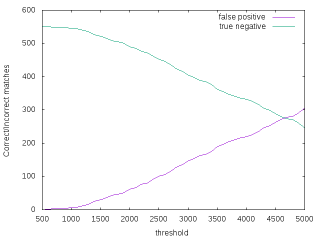

# Project 3: Eigenfaces


Used std::vector instead of std::list in the implementation of findFaces. I tried
importing <algroithm> to use C++ STL sort function but the program didnt
accept the linkage. Hence, I had to write my own quick sort algorithm for this
purpose.

What worked?

The interesting & the neutral as well as group folders worked really well.

What didnt work?

My program experienced really bad genralization errors. I tried number of test
files of various scales with different min/max thresholds but the results were
pretty disappointing. However, since the insample result was good, it seems to be
the shortcoming of the algorithm itself.

## 1) Testing recognition with cropped class images


```
Fig 1: Eigen faces for neutral folder
```

```
Fig2: Average face for neutral folder
```
### Questions:

**Describe the trends you see in your plots. Discuss the tradeoffs; how
many eigenfaces should one use? Is there a clear answer?**

Below is the plot of correct regonition vs number of eigen values used. One can
observe that initially with more eigen vectors/values we got better results.
However, we can also observe saturation starting at k = 15 and above. Hence for
extra computation, we are starting to get marginally less correct perfromace.
Hence, I would say k = 15 is an ideal choice for eigen values which is about 5/8th
of the number of images used.


```
Fig3: correct recognition vs number of eigen-values
```
**You likely saw some recognition errors; show images of a couple. How
reasonable were the mistakes? Did the correct answer at least appear
highly in the sorted results?**


In folder “Interesting”, false positives were observed for 02.tga, 03.tga, 04.tga,
07.tga, 15.tga, 06.tga and 21.tga for the program recognizing the photos when
folder “neutral” was used to compute the userbase. i.e. with 100%-(7/24*100%)
~ 70% accuracy. Almost all of them appeared in the top 3 in the sorted result.

## 2) Cropping and finding faces


### Questions:

```
Fig4: cropped_test.tga from group/single_test.tga image
```

```
Fig5: single image preformace
```

```
Fig6: Group image preformace
```
**What min_scale, max_scale, and scale step did you use for each image?**

For single image, min scale was 0.2 and max was 0.6 and I got best result at 0.28.

The step was 0.2.

For multiple people image, min scale was 0.2 and max was 0.9 and I got best

result at 0.7. The step was 0.5.

**Did your attempt to find faces result in any false positives and/or false**

**negatives? Discuss each mistake, and why you think they might have**

**occurred.**

Following are the examples of what I got. All result images for folder groups can

be found in the images folder in this artifact.


```
Fig 7: Good results with “group”
```
The bad results are also shown below. Some of the images were surprisingly bad.

However the best scores among them started at MSE score > 800. It can be

observed that in figure b) the facial orientation of person 2nd from the left and the

rightmost caused the program to miss them. Similarly in c) the person 2nd from

right had more animated expression making the program choose a false positive

over his face. However, figure a) is bizarre expecially when ¾ cropped images in

“interesting” folder were recognized by program as a correct match face (07.tga

only had a mismatch). This, however was when (num eigen values)k=10. With

larger k we expect better results.


```
Fig 8: Bad results with “group”
```
# 3) Verify Face

## Questions:

**What MSE thresholds did you try? Which one worked best? What search
method did you use to find it?**
I used iterative search to search (see file: recog.sh) the best MSE threshold
starting from 500 and ending at 5000. Below is a graph of true positives vs false
negatives. True positives are defined when 01.tga in “neutral” folder matches
01.tga in “interesting” folder. False negatives mean when 01.tga in “neutral” did
not match 01.tga in “interesting”. We can see that as MSE > 4600, the true
positive rate is 100%

Meanwhile, figure 8 shows false positive rate against true negatives. When MSE >
4600, the false positive rate becomes greater than 50% which is bad! Hence, a
sweet spot of 1400-3000 gives the highest ROC values.


```
Fig 9: True positive vs false negative in verification of 24 images of neutral folder
vs interesting folder. TP+FN=
```

```
Fig 10: False positive vs true negative in verification of 24 images of neutral folder
vs interesting folder. Total files cross verified is 576. FP+TN=
```
**Using the best MSE threshold, what was the false negative rate? What
was the false positive rate?**

The “best” threshold depends on situations modeled by some cost matrices.
Sometimes we might want high false negatives to high false positives. This is
especially in situations where we don't want innocent people to be held
responsible for things they didnt do (in our context, based on face detection
algorithms). In other sitations false alarm may not be that bad. I used MSE
threshold = 2000 and got,

false -ve rate: FNR = FN/(TP+FN) = 5/24 x 100% ~ 20%
false +ve rate: FPR = FP/(FP+TN) = 62/552 x 100% ~ 11%


