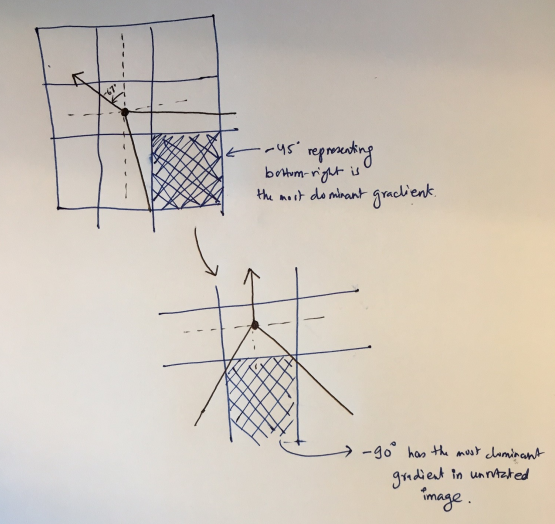
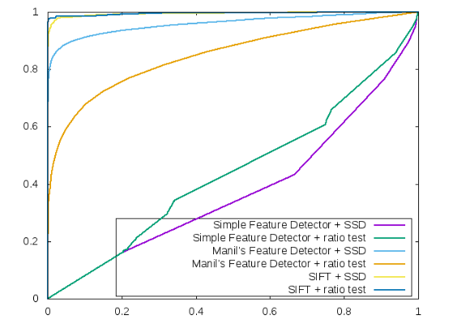
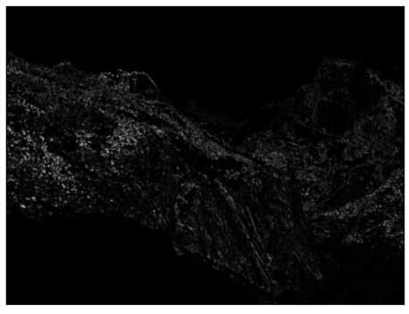
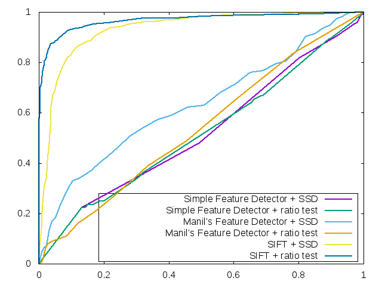
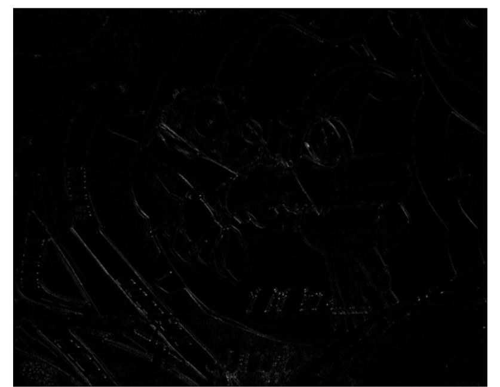
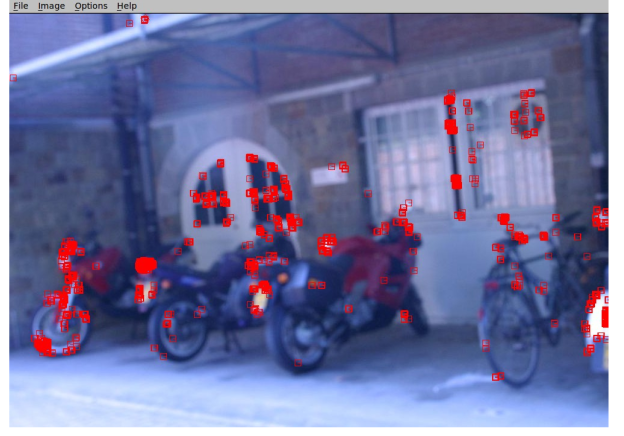
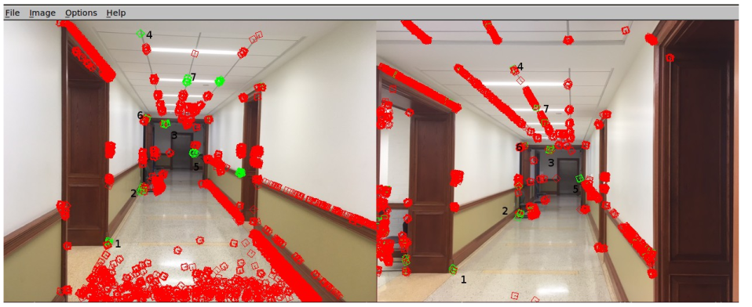
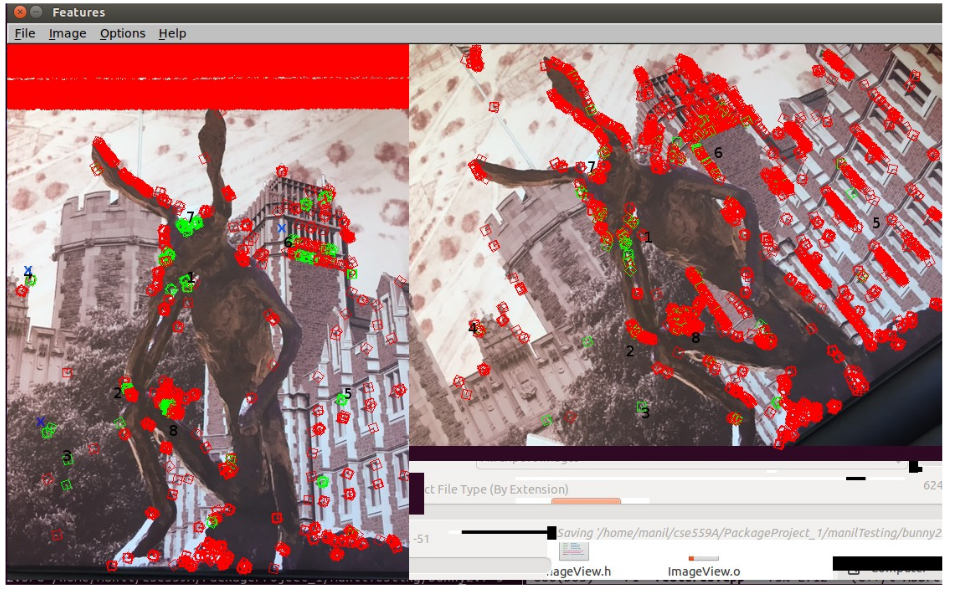
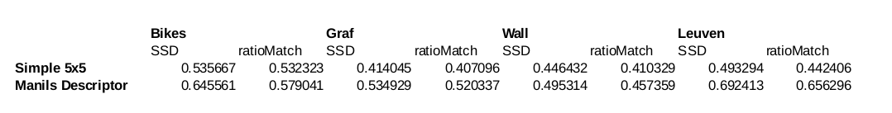

#Project 1: Feature Detection and Matching

**Detector Design:**

My feature descriptor called manilsFeatureDescriptor is an extension of simple5x5featureDescriptor.
Both manilsFeatureDescriptor and simple5x5featureDescriptor take gray-scaled input image(input) and
reference to the feature set (output) as parameters. Both feature descriptor functions take a computed
local maxima point using Harris corner detector algorithm and add some 'characteristics' to the detected
feature points.

In **simple5x5FeatureDescriptor** , I compute the gradient at each pixel in a 5×5 window around the
detected keypoint. A single histogram is generated for gradient orientation in the window with bin size
of 8. The number 8 comes from the number of orientations around each point: Top, Left, Right,
Bottom, Top-left, Top-right, Bottom-left and Bottom-right which corresponds to angle 90, 190, 0, 270,
135, 45, -135 and -45 degrees respectively. The histogram is created from the most dominant
orientation ie the max of all eight orientation at each pixel. The histogram is stored as feature data
which can later be compared by the matcher function.

**ManilsFeatureDescriptor** is an extension of simple5x5FeatureDescriptor where I implement a hybrid
of SIFT. SIFT-like attributes of the features are formed by computing the gradient at each pixel in a
larger 20×20 window around the detected keypoint. Each window is subdivided into 16 cells of 5x
pixels and gradient orientations in each cell are computed to form orientation histograms. The gradient
magnitudes for each orientation pixel are downweighted by a Gaussian fall-off function (I use
Gaussian7x7 kernel with sigma 2.5. This kernel worked the best for the 5x5 cell size compared with
5x5 and 7x7 and 9x9 kernel with sigma 1) to reduce the influence of gradients far from the center as
well as to smooth the cell region for any noise.

As in MOPS, To compensate for affine photometric variations such as brightness, cell intensities are re-
scaled so that their mean is zero and their variance is one. This normalizing is done by subtracting the
average cell intensity from each pixel and diving the value by standard deviation in the cell intensities.

Finally, rotational invariance is achieved by finding the angle of the most dominant eigen vector of the
detected feature. In my implementation instead of rotating the pixel window to compensate for any
rotations, I “rotate” the histogram bins instead. For example, I first order the orientations in the bins i.e
for each histogram, bin 0 corresponds to -135 degrees, bin 1 corresponds to -90 degrees, bin 2
corresponds to -45 degrees and so on up to bin 8 signifying 180 degrees. If the angle of the dominant
eigen value is say -67 degrees (See figure 1 below), then I integer divide this value by 45 (degree) to
get -1 as an offset. Now, lets assume that the most dominant gradient orientation came out to be
bottom-right (ie -45 degrees). Without angular correction, this value would have been added to bin 2.
However, with angular correction, this orientation will be added to bin 1 (default bin + offset => 2 + -
= 1 ). This is the bin representing -90 degrees which is the case if the image was unrotated.


```
Figure 1: Rotational Invariance by “rotating” histogram bins.
```
**2) Design Choices:**

In detector design, I initially tried Harris threshold to be around 0.0001 and played with the values.
However, I saw that I get very high number of detector keypoints for a “good” image like bike1.jpg
which virtually none for very blurred image like bike6.jpg. Hence, I implemented a dynamic
threshold:= HARRIS_THRES = (maxHarrisVal-minHarrisVal)*.06+minHarrisVal , where
maxHarrisVal and minHarrisVal are the maximum and the minimu (C = determinant H/ trace H).
Similarly, the gradient threshold is computed as one tenth of maximum gradient value in the entire
grayscale image i.e GRADIENT_THRES = maxGradVal*.1. Such dynamic thresholding has made my
detector algorithm robust to blurring and lighting conditions.

I save runtime speed by multiplying gaussian kernel pixels instead of convolving the gaussian function


as I compute the Harris corner weight or detector gradient weight. However, I lose run-time speed by
using 20x20 window size for manilsFeatureDetector. This however is due to the fact that two 128
dimensional vectors take longer in matching rather than in features computation itself. The matcher can
very well be enhanced for real-time matching. Meanwhile, SIFT which is the state of art algorithm uses
64x64 pixels and does it in fair amount of time.

In the rotational invariance, I “rotate” the bins rather than the descriptor window. This is mainly to save
time as a rotated 5x5 window at worse case (45 degree rotation) is a 10x10 window with masked
pixels. I do not think that rotating histogram bins would be erroneous as each 8 orientation in the
histogram comes from 8 pixels around the detector pixel. And all eight pixels have one-to-one map in
my histogram rotation i.e. there is no loss of information or bad rotation due to rotating the histogram
bin. Had each gradient orientation came from more than one pixel (besides the detector pixel), we
would run into issues such as sub-pixel sampling, etc.

Finally, the **feature type in compute feature takes additional value 3.** When feature type is 2 the
program runs default Harris operator for detection and simple5x5Descriptor for description. When
feature type is 3 the program runs Harris operator that also computers rotation angle of the dominant
eigenvaule for detection and manilsFeatureDescriptor for description.

**Performance:**

Yosemite:


```
ROC plot
```


```
Result of Harris Operator on Yosemite1.jpg. The pixels have been multiplied by 255 for better
visibility
```
Graf:


```
ROC plot
```

S```
Result of Harris Operator on Graf's Img1.jpg. The pixels have been multiplied by 255 for better
visibility
```
**Manil's Test Images**


```
Good features due to dynamic harris thresholding in bike img6.jpg
```

```
Feature matching with manilsFeatureDescriptors for sligt image translations
```

```Feature matching with SSD and manilsFeatureDescriptors for image rotation (Labels with x show bad
match)
```

```
Avergage AUC across benchmark sets
```
```
Strengths/Weaknesses:
```
```
Strengths:
1) Number of detected keypoints do not get significantly low due to excessive blurring because of
dynamic harris thresholding
2) The descriptors are illumination invariant
3) Rotation invariant in 2d plane
```
```
Weakness
```
```
1)My ratio match algorithm performed worse than SSD match in most of the cases. This could be due to
smaller distances between first and the second matching descriptors in cases where desrciptors are very
similar. Some kind of BAG of words matching might resolve the issue.
```
```
2)Not so good with 3d rotations in case of benchmark files graf and walls
```
```
3)Not scale invariant
```
```
4)Descriptors matching takes too long with simple5x5 descriptor for benchmark files leuven and wall.
One reason could be that without any gaussian filtering, the threshold for bad gradient is not cut off the
there is much variance in the histograms.
```
```
Extra Credit:
```
```
1) Illumination Invariant
```

As discussed earlier, this normalizing is done by subtracting the average cell (5x5) intensity from each
pixel and diving the value by standard deviation in the cell intensities. For the benchmark folder
Leaven, the average AUC using SSD before normalizations = 0.4739. After, the nomalization, the
average AUC = 0.

```
2) Rotation Invariant
```

For the benchmark folder Graf, the average AUC using SSD before rotation correction = 0.4324. After,
the correcting, the average AUC = 0.5203. This is not a significant difference. The result could be due
to high 3d rotation in graf. In other example such as Bunny image above, rotation correction improved
the result significantly.


