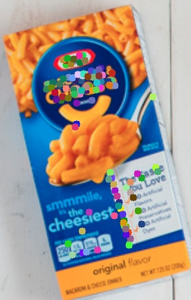
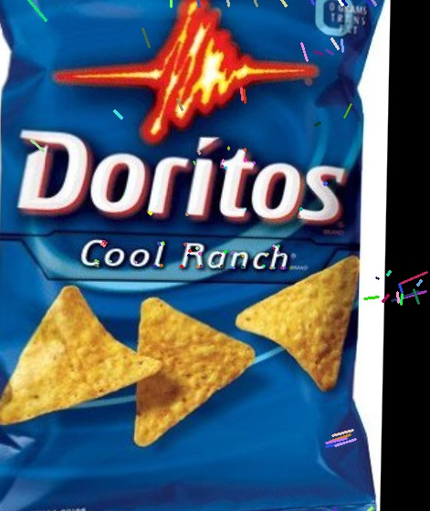

# Feature Matching

This project implements feature generation and matching using OpenCV library. We observe two classes of object types: The first is solid cube shaped object such as a cereal box that is ideal for homography transforms and post processes. The second is deformable object such as a bag of chips that can be physically distored between two images and homographies and post processing may fail on them. In this project we observe the usage of optical flow on the 2nd category to check viability of estimating such distorions. 

### Feature generation with SIFT

  
  
  	
  	

  
  
  	
  	

### Feature matching with FLANN based KNN Matcher

  

  

### Homography estimation and Transform

  

  

Below shows the source and the destination images rescaled to destination sizes with source images transformed to the perspectives of the destination image. The third image shows difference in pixels between the two. Note large difference in the 2nd category item.

  
  
  

  
  
  

### Optical Flow to visualize disortions

The usage of Optical flow provides vectors to the deformation in the destination object with respect to source.

  
  	

  
  	

    