# Image Restoration and Coloring

This project tackles image restoration and coloring for old damaged black and white images. The restoration problem tackels automatic damaged region detection which turns out to be a hard problem to automate. The successful resotrations still require some form of tweaking the Kernel parameters (dilate/erode/color threshold, etc.) in the code. The coloring portion Opencv DNN based Caffe framework to colorize black and white images. One can find the Caffe models [here](https://github.com/richzhang/colorization/tree/master/models)

Restoration is based on two methods which can be used depending on the situation. First uses simple thresholding + bilateral filter to generate the masks. This is useful in cases where images need not be context aware and the foreground/background separation is good. The second method uses thesholding followed by foreground/background segmentation which is robust in cases where background and foreground color are in close range. Both methods currently only work for whitened damaged regions but can be extended to any colored regions. One can note the difference in masks for first method and second method below:


<p float="left">
  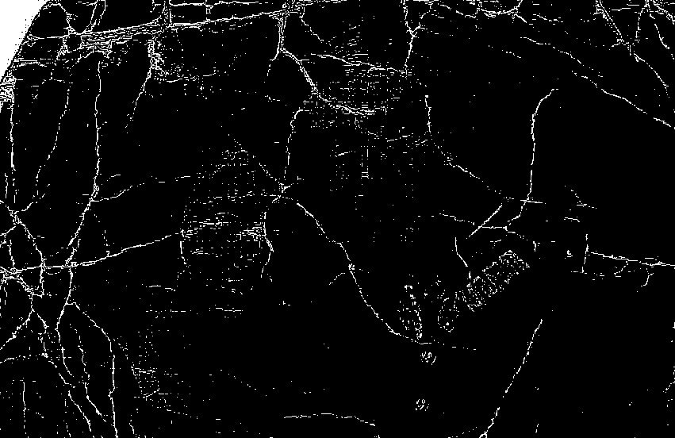
  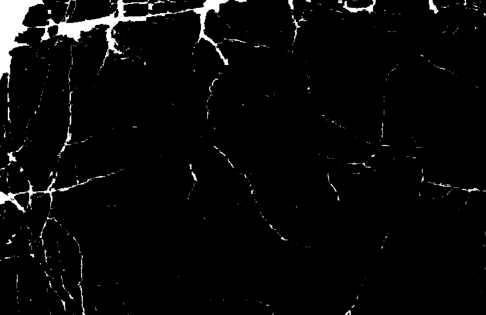 
</p>

```
Damage masks generated by method 1 and 2 respectively
```

<p float="left">
  
  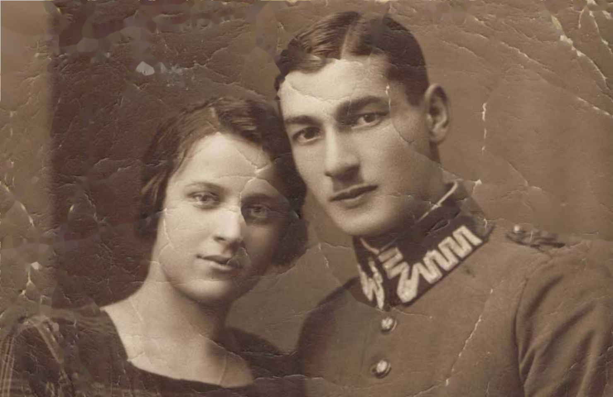 
</p>

```
Corresponding outputs from the damage masks. Note that method 2 performs better in this example.
```

<p float="left">
  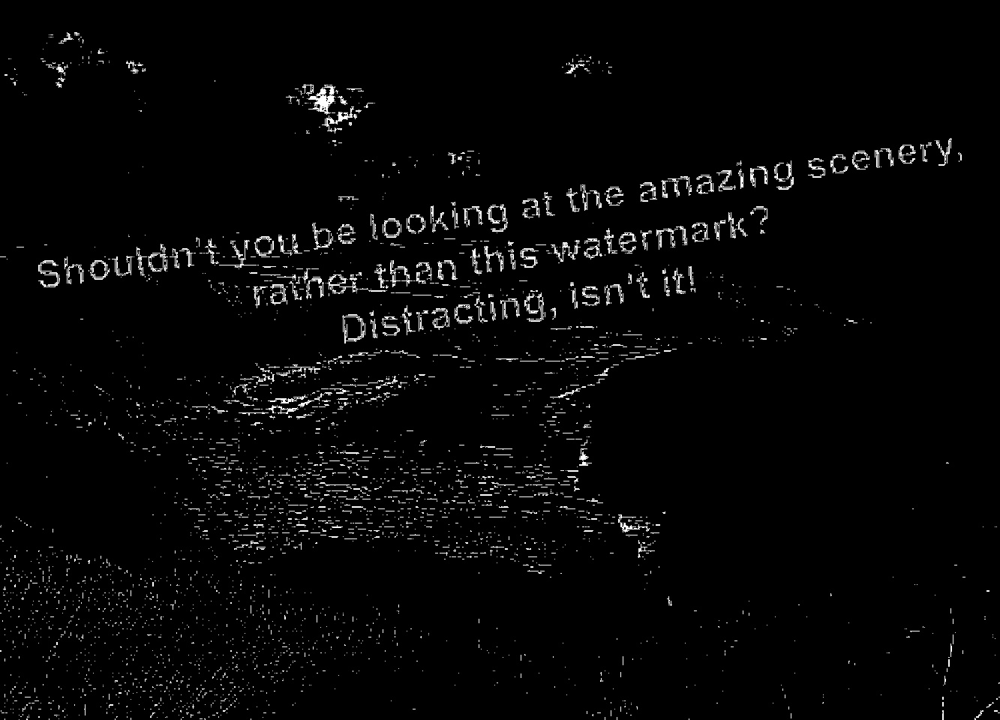
   
</p>

```
Damage masks generated by method 1 and 2 respectively
```

<p float="left">
  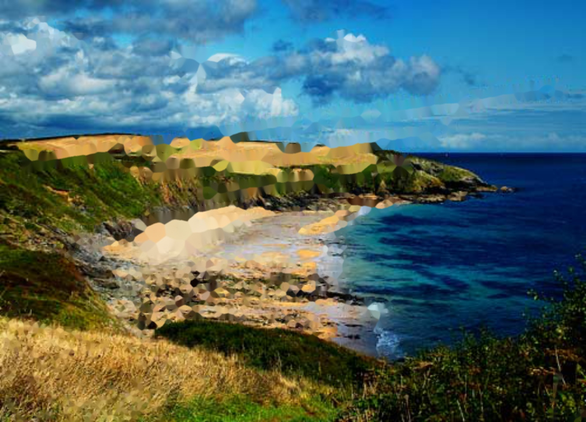
  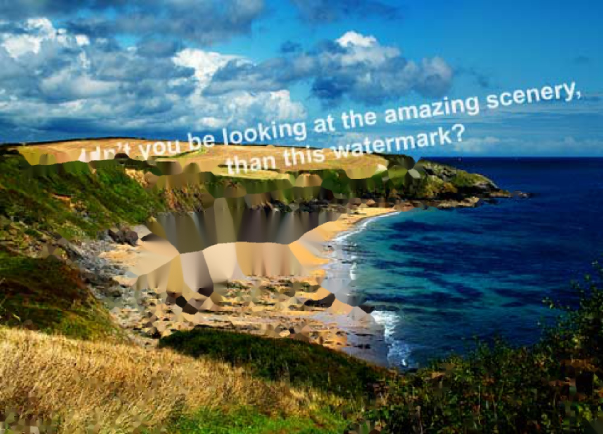 
</p>

```
Corresponding outputs from the damage masks. Note that method 1 performs better in this example.
```


## Some samples:


### Restoration Only (Watermarks removal)

<p float="left">
  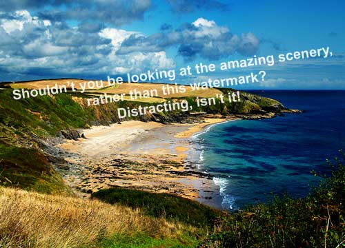
   
</p>

<p float="left">
  
   
</p>

<p float="left">
  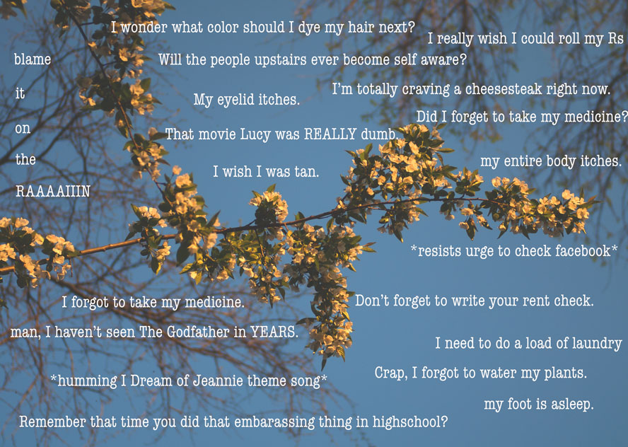
   
</p>

### Colorize Only

<p float="left">
  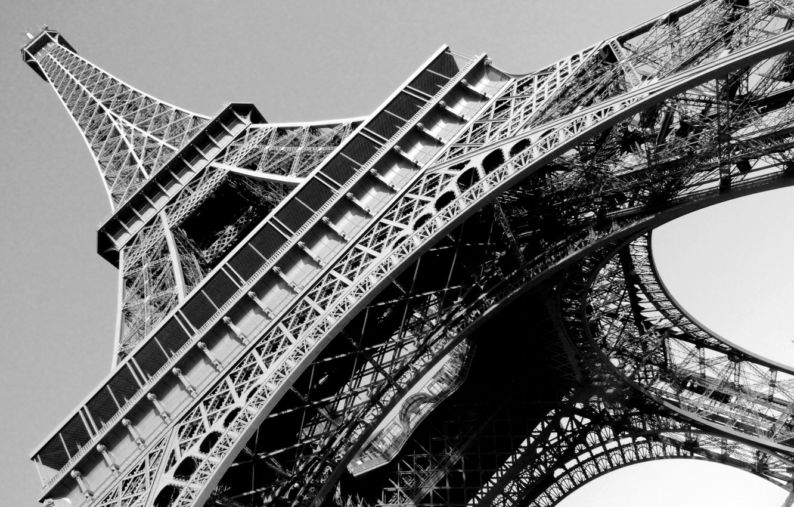
  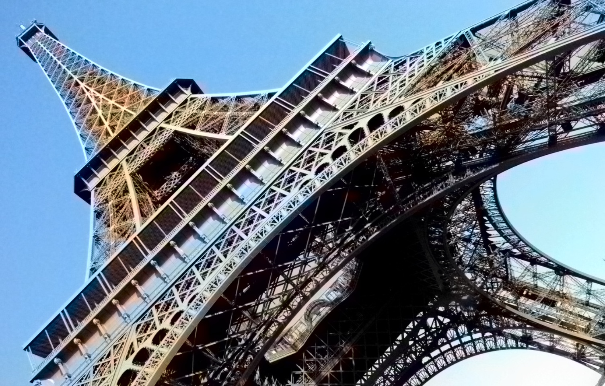 
</p>

<p float="left">
  
   
</p>

<p float="left">
  
   
</p>


### Restoration + Coloring

<p float="left">
  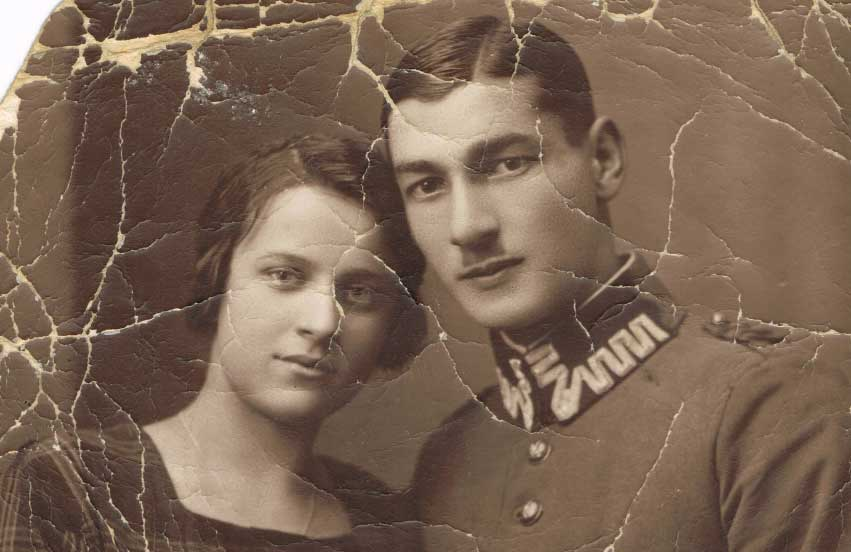
   
</p>

<p float="left">
  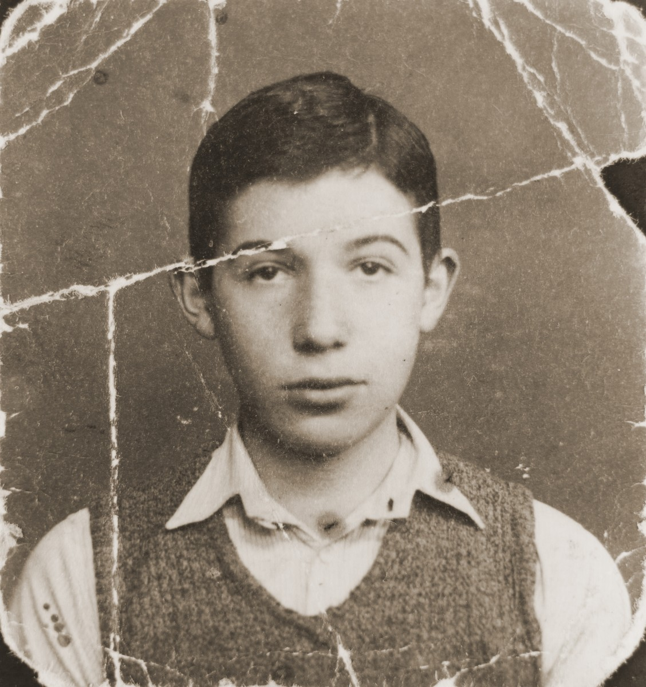
  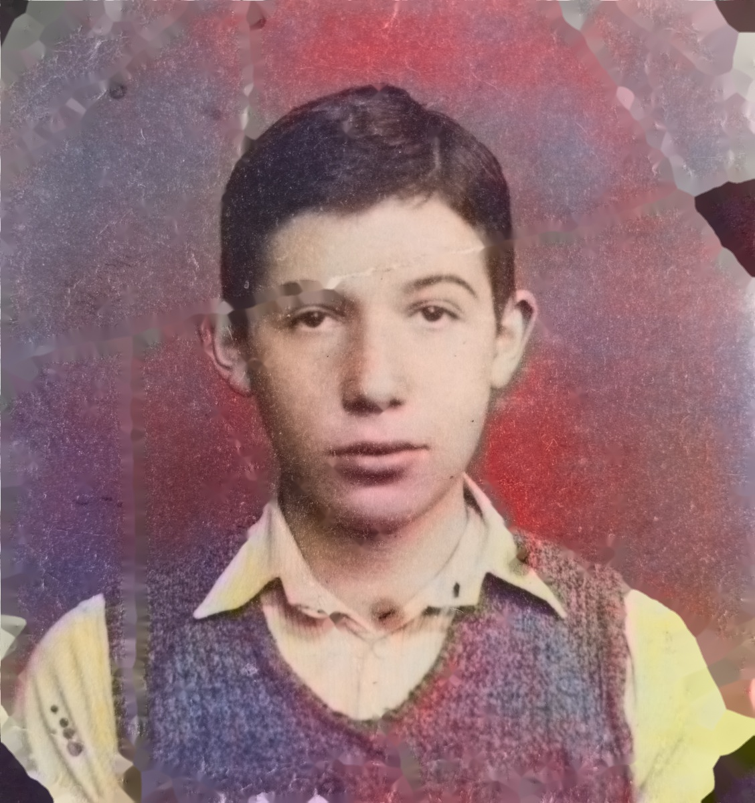 
</p>

<p float="left">
  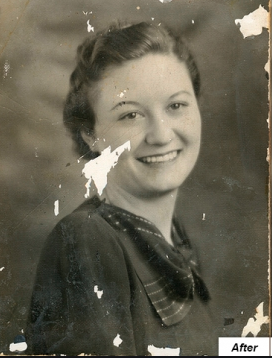
  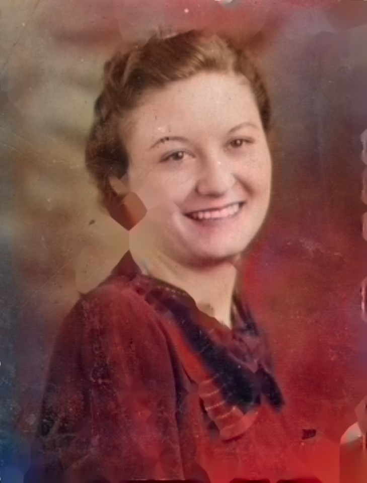 
</p>

<p float="left">
  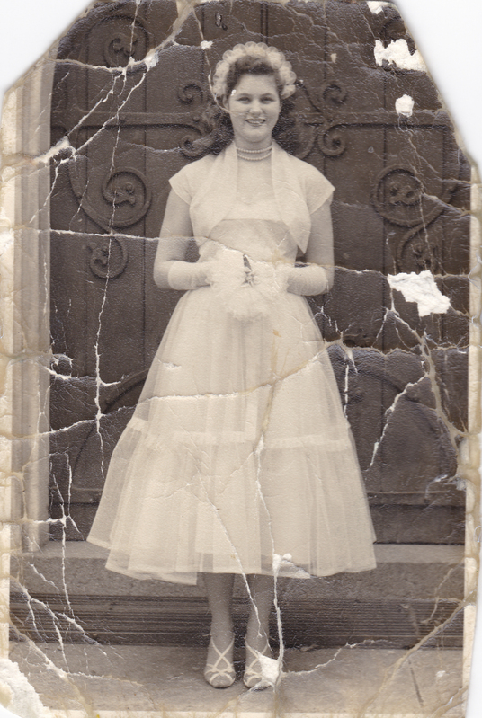
  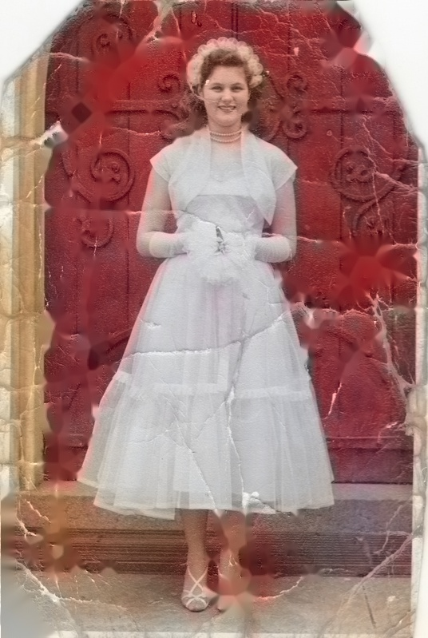 
</p>

<p float="left">
  
   
</p>


